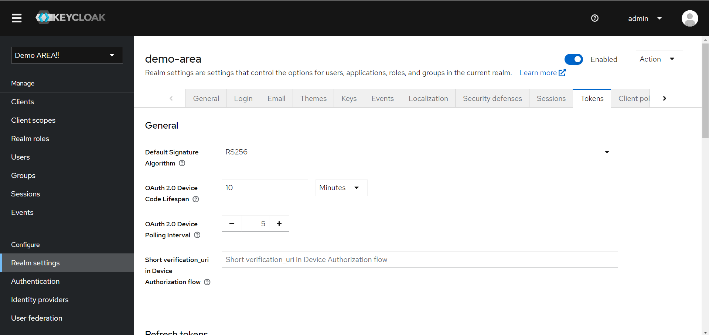

# Настройка Backend для Client

Задача Backend приложения - проверять валидность токена авторизации, полученный от **Client** приложения (токен был сформирован **Keycloak**).

*(При необходимости Backend "resource" может посылать запросы для декодирования токена и проверки его активности в **Keycloak**, но во избежания большого количества запросов, рекомендуется производить декодирование и проверку валидности токена в Backend)*

Проверку токена необходимо осуществлять по следующим критериям: 
- проверка формата токена
- проверка структуры токена
- проверка `exparation_time` - `exp`
- "сущетсование прав пользователя на доступ к запрашиваемому ресурсу" (**Client** правило)

В каждом токене содержится информация о пользователе и его правах, после проверк (так же содержится информация о токене и способе его производства: **Client**, **Realm**, ...), информация доступна после дешифрования токена.

По умолчанию на **Client** используется алгоритм шифрования для `access_token` RS256. Для просмотра/изменения алгоритма шифрования нужного **Client** необходимо перейти в соответсвующий раздел внутри admin panel **Keycloak**. "**Realm Settings --> Tokens --> General**":


Для Backend на **Laravel** версии (7.x, 8.x, 9.x, 10.x, 11.x)*[проверенные версии на момент составления инструкции]* рекомендуется использовать расширение для Laravel [robsontenorio/laravel-keycloak-guard](https://github.com/robsontenorio/laravel-keycloak-guard):
```sh
composer require robsontenorio/laravel-keycloak-guard
```
Данное расширение устанавливает конфигурацию guard-драйвера, с помощью которого можно не заморачиваться над настройкой проверки токена.

***(TODO: маршрут для обновления пользовательских данных в локальной БД, когда на Frontend-е осуществляется авторизация для пользователя)***