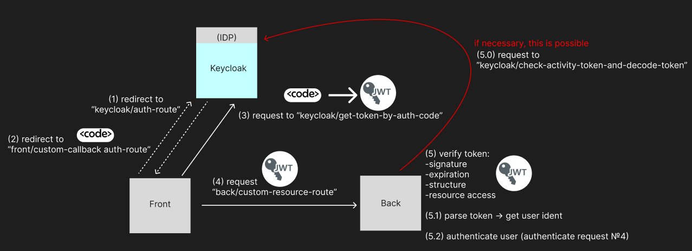

# Вариант использования

## Авторизация Frontend + Backend (ODIC)

Вариант использования **Keycloak** для аутентификации и авторизации приложения **Frontnd + Backend** (через ODIC) представлен на схеме ниже:

Keycloak берёт на себя роль IDP.
1) Когда пользователь хочет авторизоваться в приложении **Front**, то приложение отправляет пользователя в **Keycloak** на маршрут аутентификации, где пользователь может ввести автаризационные данные `username` и `password`, которые должны быть заранее занесены в **Keycloak**.
2) Когда введены корректные данные пользователя, то **Keycloak** перенаправляет его в **Front** устанавливая авторизационный код для сеанса пользователя в query param `code`, на маршрут, который задаётся в query param `redirect_uri` при переадресации пользователя в **Keycloak** (шаг 1).
3) **Front** получает `JWT токен` запрашивая его у **Keycloak**, передавая `code` на соответсвующий маршрут.
*(**Keycloak** возвращает всю информацию о пользователе, которая содержится в системе, а так же всю информацию об его сеансе авторизации и `access_token`, `refresh_token`, `id_token`)*
4) **Front** будучи авторизованым с помощью **Keycloak** может обращаться к **Backend**, прикрепляя к запросу `access_token`, который содержит информацию о пользователе, позволяющую его идентефицировать в  **Backend**.

5) **Backend** может расшифровать токен, предварительно зная алгоритм его шифрования *(алгоритм шифрования может быть установлен в админ панели **Keycloak**, по умолчанию установлен RS256)*. Так же при каждом новом запросе от **Frontend**, **Backend** должен проверять активность токена, сопостовляя текущее вреия с `exp` - "exparation time" из `access_token`.
*(При необходимости **Backend** может проверять валидность и декодирование токена отправляя его на соответсвующий маршрут в **Keycloak** - проверено, только в приложении с монолитной архитектурой, где у backend и frontend один домен)*.

## Админка для Keycloak (API)

У **Keycloak** есть возможность использовать API, имеющее весь функционал из admin panel. 

Для использования API авторизовывать с помощью `<bearer-token>`.
Для получения `<bearer-token>` необходимо отправить запрос на авторизацию в *"необходимый **Client**"*

Например для получения полного доступа к API:
1) Получить `<bearer-token>`:
    * POST `<keycloak-domain>/realms/master/protocol/openid-connect/token`
    * Body params:
        - username: `<keycloak-admin-username>`
        - password: `<keycloak-admin-password>`
        - client_id: `admin-cli`
        - grant_type: `password`
    * Response:
        - token_type: `Bearer`
        - access_token: `<bearer-token>`
2) Получить сеансы, связанные с пользователем:
    * GET `<keycloak-domain>/admin/realms/<realm>/users/<user-id>/sessions`
    * Headers:
        - Authorization: `<bearer-token>`

*(По умолчанию такой `<bearer-token>` будет действителен 60 секунд - это регулируется в админке)*
*(**Client** `admin-cli` создается по умолчанию в родительском **Realm** - master)*

[Подробнее об API (Keycloak API 24.0.4)](https://www.keycloak.org/docs-api/24.0.4/rest-api/index.html)